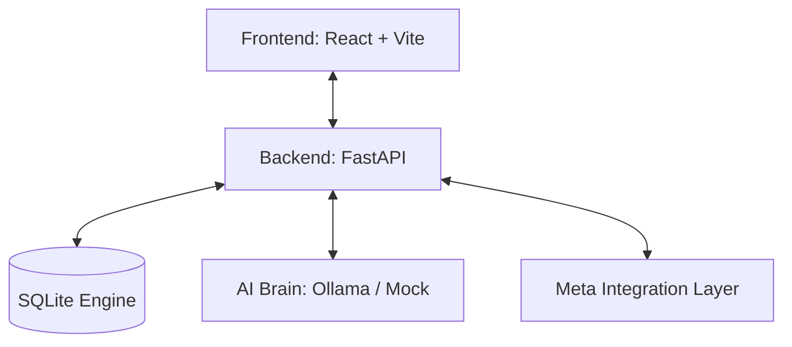

# ⚡ AdSage — Meta Ads AI Agent

<div align="center">
  
  
  
  
</div>

<br />

> **The Observatory:** A high-performance, autonomous platform that optimizes Meta Ads using specialized AI agents. Transitioning from manual management to neural precision.

### 🌐 [**Launch Live Demo**](https://ad-sage-mu.vercel.app/)

---

## ✨ Features
- **The Observatory:** Real-time dashboard with glassmorphism aesthetics.
- **Autonomous Agents:** Three specialized LLM agents monitoring CPA, ROAS, and scaling.
- **Human-in-the-Loop:** Approve or reject agent recommendations with one click.
- **Spider-Verse UI:** Cutting-edge design system with high-contrast animations and glowing components.
- **Demo Engine:** Realistic simulation of campaigns, audiences, and performance trends.

## 🤖 The Agents
| Agent | Designation | Core Directive |
|:---:|---|---|
| 🔍 | **Performance Detective** | Detects fatigue, identifies high-CPA outliers, and alerts on anomalies. |
| 💰 | **Budget Strategist** | Optimizes capital allocation by shifting funds from declining to scaling assets. |
| 🚀 | **Growth Executor** | Duplicates winning audiences and scales budgets for high-ROAS consistency. |

## 🛠️ Architecture


## 🚀 Quick Start

### 1. Clone & Run Backend
```bash
cd backend
python -m venv venv
# Windows
venv\Scripts\activate
# Install
pip install -r requirements.txt
# Launch
uvicorn app.main:app --reload --host 0.0.0.0 --port 8000
```

### 2. Run Frontend
```bash
cd frontend
npm install
npm run dev
```
Open [http://localhost:5173](http://localhost:5173)

---

## 🏗️ Technical Stack
- **Frontend:** React, TypeScript, Tailwind CSS, Framer Motion, Recharts.
- **Backend:** Python, FastAPI, SQLAlchemy (SQLite), Pydantic.
- **Deployment:** Vercel (Frontend), Render (Blueprint Ready).

---

<p align="center">
  Built for the future of marketing. <b>AdSage AI</b> — Deploy your edge.
</p>
